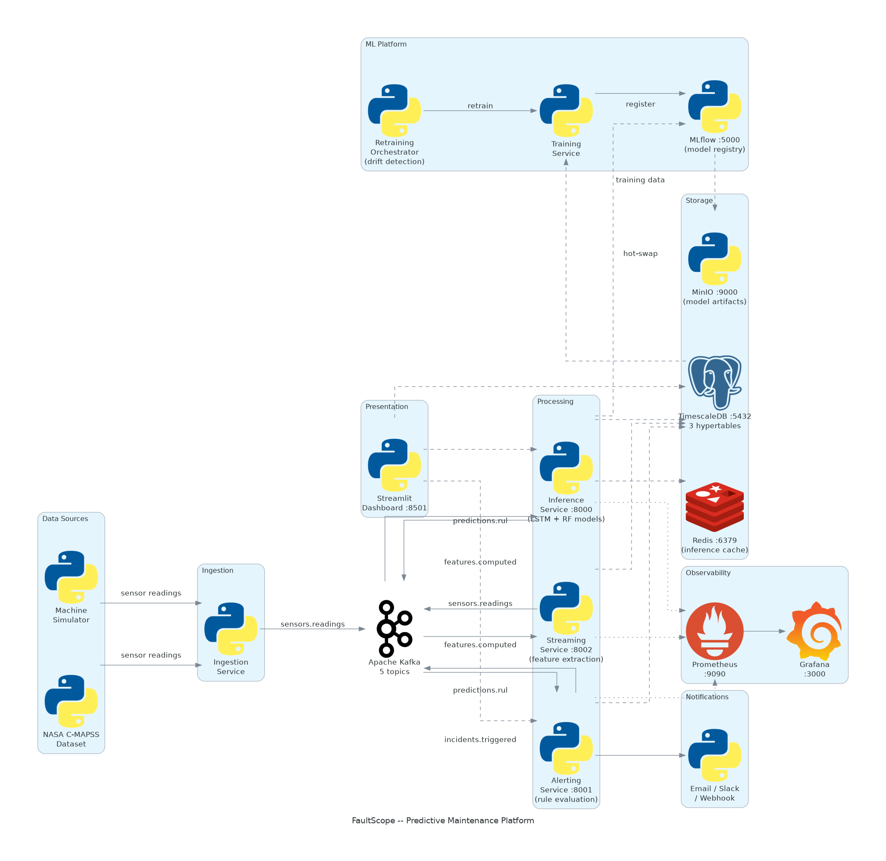

<p align="center"></p>
<!-- TODO: create banner (dark background, circuit-board/machinery motif, "FaultScope" title, tagline) and save as assets/banner.png -->

<h1 align="center">FaultScope</h1>
<p align="center">Real-time predictive maintenance for manufacturing equipment using streaming ML and anomaly detection</p>

<p align="center">
  <a href="LICENSE"></a>
  
  
</p>

---

**Navigation:**
[What it does](#what-it-does) |
[Architecture](#architecture) |
[Quick start](#quick-start) |
[Local development](#local-development) |
[Configuration](#configuration) |
[API reference](#api-reference) |
[Data model](#data-model) |
[Observability](#observability) |
[Scaling](#scaling-considerations) |
[Design decisions](#design-decisions) |
[Security](#security-model) |
[Known limitations](#known-limitations) |
[License](#license)

---

## What it does

FaultScope ingests live sensor telemetry from manufacturing equipment, extracts time-domain and spectral features in real time, and runs ML models to predict how many cycles of useful life remain for each machine. When predictions cross configurable thresholds, it fires alerts to your team via email, Slack, or webhooks and tracks the full incident lifecycle through resolution.

It is aimed at manufacturing operations teams and maintenance engineers who want to shift from schedule-based maintenance to condition-based intervention.

**The core pipeline:**

1. Raw sensor readings stream from physical machines (or a built-in simulator) into Kafka.
2. A streaming service extracts rolling statistical and spectral features across configurable time windows.
3. An inference service loads trained LSTM and Random Forest models, producing a remaining useful life (RUL) estimate with uncertainty bounds plus a health classification label.
4. An alerting service evaluates predictions against 9 configurable detection rules, suppresses duplicates, and dispatches notifications.
5. A Streamlit dashboard and Grafana panels give operators a live view of fleet health, incidents, and model performance.

---

## Architecture

<p align="center"></p>

| Service | Port | Purpose |
|---------|------|---------|
| Ingestion | -- | Kafka producer; three modes: simulation, NASA C-MAPSS dataset, mixed |
| Streaming | 8002 | Consumes raw readings, publishes engineered features |
| Inference | 8000 | FastAPI model server; RUL regression + health classification |
| Alerting | 8001 | FastAPI rule evaluation, incident lifecycle management, notifications |
| Dashboard | 8501 | Streamlit fleet overview, equipment detail, incident tracker |

**Infrastructure dependencies:**

| Component | Port | Purpose |
|-----------|------|---------|
| Kafka + Zookeeper | 9092 | Durable event backbone, message ordering per machine |
| TimescaleDB | 5432 | Time-series data warehouse; 3 hypertables, 2 continuous aggregates |
| Redis | 6379 | Inference result cache |
| MinIO | 9000 | S3-compatible artifact store for ML models |
| MLflow | 5000 | Experiment tracking and model registry |
| Prometheus | 9090 | Metrics collection |
| Grafana | 3000 | Metrics dashboards |

**Kafka topics:**

| Topic | Partitions | Produced by | Consumed by |
|-------|-----------|-------------|-------------|
| `faultscope.sensors.readings` | 6 | Ingestion | Streaming |
| `faultscope.features.computed` | 6 | Streaming | Inference |
| `faultscope.predictions.rul` | 3 | Inference | Alerting |
| `faultscope.incidents.triggered` | 3 | Alerting | Dashboard |
| `faultscope.dlq` | 1 | All services | Monitoring |

All messages are keyed by `machine_id` to preserve per-machine ordering across partitions.

---

## Quick start

**Prerequisites:** Docker and Docker Compose.

```bash
# 1. Clone and configure environment
git clone <repo-url> faultscope
cd faultscope
cp .env.example .env
# Set FAULTSCOPE_DB_PASSWORD, FAULTSCOPE_INFERENCE_API_KEY,
# and FAULTSCOPE_MINIO_SECRET_KEY in .env before continuing.

# 2. Start the full stack
make run-all

# 3. Load demo data (NASA C-MAPSS + synthetic readings)
make seed

# 4. Train initial models
make train

# 5. Verify services
make health
```

**Service URLs after startup:**

| Service | URL |
|---------|-----|
| Streamlit dashboard | http://localhost:8501 |
| Inference API docs | http://localhost:8000/docs |
| Alerting API docs | http://localhost:8001/docs |
| Grafana | http://localhost:3000 (admin / admin) |
| MLflow | http://localhost:5000 |
| Prometheus | http://localhost:9090 |

To stop and remove all containers but preserve data volumes:

```bash
make stop
```

To stop and delete volumes (destructive):

```bash
make stop-clean
```

---

## Local development

**Prerequisites:** Python 3.12+, [uv](https://github.com/astral-sh/uv), Docker (for infrastructure).

```bash
# Bootstrap the virtual environment
make setup

# Start only infrastructure (Kafka, TimescaleDB, Redis, MinIO, MLflow, Prometheus, Grafana)
make run-infra

# In separate terminals, start each service:
# Terminal 1
python -m faultscope.ingestion --mode simulation --log-format console

# Terminal 2
python -m faultscope.streaming

# Terminal 3
python -m faultscope.inference

# Terminal 4
python -m faultscope.alerting

# Terminal 5
streamlit run src/faultscope/dashboard/streamlit/app.py
```

**Ingestion modes:**

| Mode | Description |
|------|-------------|
| `simulation` | Generates synthetic readings for turbofan, pump, compressor, and motor equipment with configurable degradation curves |
| `cmapss` | Streams the NASA C-MAPSS FD001-FD004 turbofan dataset |
| `mixed` | Runs simulation and C-MAPSS in parallel |

**Useful Makefile targets:**

```bash
make lint          # ruff linter + formatter check
make lint-fix      # auto-fix linting issues
make typecheck     # mypy strict type checking
make test          # unit + integration tests
make test-unit     # unit tests only (no containers needed)
make test-integration  # integration tests (requires Docker)
make test-e2e      # end-to-end tests (requires full stack running)
make coverage      # HTML coverage report (minimum 80% enforced)
make clean         # remove __pycache__, .pytest_cache, reports
```

**Non-obvious gotchas:**

- Integration tests use testcontainers to spin up ephemeral Kafka and PostgreSQL instances. First run pulls images and is slow.
- `make train` requires infrastructure to be running (MLflow, MinIO, TimescaleDB) and demo data to be seeded first.
- The inference service polls MLflow for new model versions every 60 seconds (configurable). After training, allow up to one polling interval before new models are served.
- The Kafka topic initialization script (`infra/kafka/create-topics.sh`) runs automatically inside the Docker Compose stack. In bare-metal setups, run it manually against your broker.
- MC Dropout at inference time means 10 forward passes per RUL prediction. Under load, this multiplies GPU/CPU time by 10.

---

## Configuration

All settings use the `FAULTSCOPE_` prefix and are read from environment variables or a `.env` file. The `.env.example` file contains every available variable with comments.

**Required variables (no defaults):**

| Variable | Used by | Description |
|----------|---------|-------------|
| `FAULTSCOPE_DB_PASSWORD` | All services | TimescaleDB password |
| `FAULTSCOPE_INFERENCE_API_KEY` | Inference | X-API-Key value for prediction endpoints |

**Critical variables to change from defaults before any production deployment:**

| Variable | Insecure default | Description |
|----------|-----------------|-------------|
| `FAULTSCOPE_MINIO_SECRET_KEY` | `changeme_in_production` | MinIO secret key |
| `FAULTSCOPE_MINIO_ACCESS_KEY` | `minioadmin` | MinIO access key |

**Key settings by category:**

### Kafka

| Variable | Default | Description |
|----------|---------|-------------|
| `FAULTSCOPE_KAFKA_BOOTSTRAP_SERVERS` | `localhost:9092` | Comma-separated broker list |
| `FAULTSCOPE_KAFKA_CONSUMER_GROUP` | `faultscope-main` | Consumer group ID |
| `FAULTSCOPE_KAFKA_TOPIC_SENSOR_READINGS` | `faultscope.sensors.readings` | Raw sensor topic |
| `FAULTSCOPE_KAFKA_TOPIC_COMPUTED_FEATURES` | `faultscope.features.computed` | Engineered features topic |
| `FAULTSCOPE_KAFKA_TOPIC_RUL_PREDICTIONS` | `faultscope.predictions.rul` | RUL predictions topic |
| `FAULTSCOPE_KAFKA_TOPIC_INCIDENTS` | `faultscope.incidents.triggered` | Triggered incidents topic |

### Database

| Variable | Default | Description |
|----------|---------|-------------|
| `FAULTSCOPE_DB_HOST` | `localhost` | TimescaleDB hostname |
| `FAULTSCOPE_DB_PORT` | `5432` | TimescaleDB port |
| `FAULTSCOPE_DB_NAME` | `faultscope` | Database name |
| `FAULTSCOPE_DB_USER` | `faultscope` | Database user |
| `FAULTSCOPE_DB_POOL_SIZE` | `10` | Async connection pool size |
| `FAULTSCOPE_DB_MAX_OVERFLOW` | `20` | Extra connections allowed beyond pool size |

### Inference service

| Variable | Default | Description |
|----------|---------|-------------|
| `FAULTSCOPE_INFERENCE_PORT` | `8000` | HTTP port |
| `FAULTSCOPE_INFERENCE_WORKERS` | `4` | Uvicorn worker processes |
| `FAULTSCOPE_INFERENCE_MODEL_RELOAD_INTERVAL_S` | `60` | MLflow polling interval for model hot-swap |
| `FAULTSCOPE_INFERENCE_RATE_LIMIT_PER_MINUTE` | `100` | Rate limit per IP |

### Alerting service

| Variable | Default | Description |
|----------|---------|-------------|
| `FAULTSCOPE_ALERTING_PORT` | `8001` | HTTP port |
| `FAULTSCOPE_ALERTING_AGGREGATION_WINDOW_S` | `300` | Incident aggregation window in seconds |

### Notifications

| Variable | Default | Description |
|----------|---------|-------------|
| `FAULTSCOPE_EMAIL_SMTP_HOST` | -- | SMTP hostname; leave unset to disable email alerts |
| `FAULTSCOPE_EMAIL_SMTP_PORT` | `587` | SMTP port |
| `FAULTSCOPE_EMAIL_USERNAME` | -- | SMTP login |
| `FAULTSCOPE_EMAIL_PASSWORD` | -- | SMTP password |
| `FAULTSCOPE_EMAIL_FROM` | -- | Sender address |
| `FAULTSCOPE_EMAIL_RECIPIENTS` | -- | Comma-separated recipient list |
| `FAULTSCOPE_SLACK_WEBHOOK_URL` | -- | Slack incoming webhook URL; leave unset to disable |

### Streaming / feature engineering

| Variable | Default | Description |
|----------|---------|-------------|
| `FAULTSCOPE_STREAM_ROLLING_WINDOWS_S` | `10,30,60,300` | Comma-separated window sizes for temporal features |
| `FAULTSCOPE_STREAM_FFT_SAMPLING_RATE_HZ` | `100` | FFT sampling rate for spectral features |

### Training

| Variable | Default | Description |
|----------|---------|-------------|
| `FAULTSCOPE_TRAINING_SEQUENCE_LENGTH` | `50` | LSTM input window in timesteps |
| `FAULTSCOPE_TRAINING_BATCH_SIZE` | `32` | Training batch size |
| `FAULTSCOPE_TRAINING_MAX_EPOCHS` | `100` | Max training epochs |
| `FAULTSCOPE_TRAINING_EARLY_STOP_PATIENCE` | `20` | Early stopping patience |

### MLflow / MinIO

| Variable | Default | Description |
|----------|---------|-------------|
| `FAULTSCOPE_MLFLOW_TRACKING_URI` | `http://localhost:5000` | MLflow server URL |
| `FAULTSCOPE_MLFLOW_EXPERIMENT_NAME` | `faultscope-production` | Experiment name |
| `FAULTSCOPE_MINIO_ENDPOINT` | `localhost:9000` | MinIO endpoint |
| `FAULTSCOPE_MINIO_BUCKET` | `faultscope-models` | Model artifact bucket |

### Observability

| Variable | Default | Description |
|----------|---------|-------------|
| `FAULTSCOPE_LOG_LEVEL` | `INFO` | `DEBUG`, `INFO`, `WARNING`, or `ERROR` |
| `FAULTSCOPE_LOG_FORMAT` | `json` | `json` for production, `console` for local development |
| `FAULTSCOPE_OTEL_ENABLED` | `false` | Enable OpenTelemetry distributed tracing |
| `FAULTSCOPE_OTEL_EXPORTER_ENDPOINT` | `http://localhost:4317` | OTLP collector endpoint |

---

## API reference

Full documentation is available at `/docs` on each API service (Swagger UI) when running.

### Inference API (port 8000)

All endpoints except `/health`, `/ready`, and `/metrics` require:

```
X-API-Key: <FAULTSCOPE_INFERENCE_API_KEY value>
```

**Health and readiness**

```
GET /health   -> {"status": "ok", "service": "faultscope-inference"}
GET /ready    -> {"status": "ready"|"loading", "models_loaded": bool}
```

**Predict remaining useful life**

```
POST /api/v1/predict/remaining-life
```

Request:
```json
{
  "machine_id": "turbofan-001",
  "feature_sequence": [
    {"sensor_2_60s_mean": 642.3, "sensor_7_60s_rms": 554.1, ...},
    ...
  ]
}
```

Response:
```json
{
  "machine_id": "turbofan-001",
  "rul_cycles": 87.4,
  "rul_hours": 14.6,
  "rul_lower_bound": 72.1,
  "rul_upper_bound": 103.2,
  "health_label": "degrading",
  "confidence": 0.84,
  "model_version": "1.0.2",
  "predicted_at": "2026-04-03T10:22:31Z",
  "latency_ms": 42
}
```

Uncertainty bounds come from 10 Monte Carlo Dropout forward passes; `rul_lower_bound` and `rul_upper_bound` are the 5th and 95th percentiles.

**Predict health status**

```
POST /api/v1/predict/health-status
```

Request:
```json
{
  "machine_id": "turbofan-001",
  "features": {"sensor_2_60s_mean": 642.3, "sensor_7_60s_rms": 554.1, ...}
}
```

Response:
```json
{
  "machine_id": "turbofan-001",
  "health_label": "degrading",
  "probabilities": {
    "healthy": 0.06,
    "degrading": 0.74,
    "critical": 0.18,
    "imminent_failure": 0.02
  },
  "model_version": "2.0.1",
  "predicted_at": "2026-04-03T10:22:31Z"
}
```

Health labels map to RUL ranges:

| Label | RUL range |
|-------|-----------|
| `healthy` | >= 80 cycles |
| `degrading` | 50-79 cycles |
| `critical` | 25-49 cycles |
| `imminent_failure` | < 25 cycles |

**Batch prediction**

```
POST /api/v1/predict/batch
```

Up to 100 mixed RUL/health predictions per request.

Request:
```json
{
  "items": [
    {
      "request_id": "req-1",
      "prediction_type": "rul",
      "machine_id": "turbofan-001",
      "feature_sequence": [...]
    },
    {
      "request_id": "req-2",
      "prediction_type": "health",
      "machine_id": "pump-002",
      "features": {...}
    }
  ]
}
```

**Model catalog**

```
GET  /api/v1/models          -> list of active model versions with metadata
POST /api/v1/models/refresh  -> force immediate MLflow poll and hot-swap (zero downtime)
```

**Rate limiting:** 100 requests/minute per IP. Rate limit status is returned in response headers (`X-RateLimit-Limit`, `X-RateLimit-Remaining`, `X-RateLimit-Reset`). Exceeding the limit returns HTTP 429 with a `Retry-After` header.

---

### Alerting API (port 8001)

No authentication required (designed for internal network use).

**Health and readiness**

```
GET /health   -> {"status": "ok", "service": "faultscope-alerting"}
GET /ready    -> {"status": "ready", "kafka_connected": bool, "db_connected": bool}
```

**Evaluate prediction against all rules**

```
POST /api/v1/incidents/evaluate
```

Accepts a prediction payload (same shape as what the inference service publishes to Kafka). Returns the count and IDs of any incidents created.

**Incident lifecycle**

```
GET  /api/v1/incidents
     ?machine_id=<id>
     &status=open|acknowledged|closed
     &severity=info|warning|critical
     &limit=<1-200>
     &offset=<int>

POST /api/v1/incidents/{incident_id}/acknowledge
     Body: {"acknowledged_by": "operator-name"}

POST /api/v1/incidents/{incident_id}/close
     Body: {"resolution_note": "optional note"}
```

**Detection rules**

```
GET /api/v1/rules           -> list all configured rules
GET /api/v1/rules/{rule_id} -> single rule details
```

**Maintenance mode**

When enabled, all alerts for the machine are suppressed.

```
POST /api/v1/machines/{machine_id}/maintenance
     Body: {"enabled": true}
```

---

## Data model

**TimescaleDB** stores 11 tables. Three are hypertables (time-series partitioned); two have continuous aggregates materialized as 1-minute and 1-hour buckets.

### Core tables

**machines** -- Registry of monitored equipment.

| Column | Type | Notes |
|--------|------|-------|
| machine_id | text PK | Unique identifier |
| machine_type | enum | `turbofan`, `pump`, `compressor`, `motor` |
| status | enum | `active`, `maintenance`, `decommissioned` |
| installed_at | timestamptz | |
| metadata | jsonb | Optional operator notes |

**detection_rules** -- Alert rule definitions.

| Column | Type | Notes |
|--------|------|-------|
| rule_id | text PK | |
| condition_type | enum | `RUL_BELOW`, `ANOMALY_SCORE_ABOVE`, `HEALTH_LABEL_IS`, `RUL_DROP_RATE`, `MULTI_SENSOR` |
| threshold | float | Rule-specific numeric threshold |
| severity | enum | `info`, `warning`, `critical` |
| cooldown_s | int | Minimum seconds between incidents for same machine + rule |
| enabled | bool | |

### Hypertables (partitioned by time)

**sensor_readings** -- Raw telemetry. Retention: 90 days. Chunks: 1 day. Compressed after 7 days.

| Column | Type | Notes |
|--------|------|-------|
| recorded_at | timestamptz PK | Partition key |
| machine_id | text | FK to machines; also used as partition dimension |
| cycle | int | Optional cycle counter (C-MAPSS datasets) |
| readings | jsonb | `{sensor_name: float, ...}` |
| operational | jsonb | `{setting_name: float, ...}` |

**computed_features** -- Engineered features from streaming service. Retention: 90 days.

| Column | Type | Notes |
|--------|------|-------|
| computed_at | timestamptz PK | |
| machine_id | text | |
| window_s | int | Feature window used (10, 30, 60, 300) |
| temporal | jsonb | Rolling stats per sensor per window |
| spectral | jsonb | FFT-derived features |
| correlation | jsonb | Pearson correlations across sensor pairs |
| feature_version | text | Schema version (`v1`) |

**model_predictions** -- All inference results. Retention: 365 days.

| Column | Type | Notes |
|--------|------|-------|
| predicted_at | timestamptz PK | |
| machine_id | text | |
| rul_cycles | float | Point estimate |
| rul_lower_bound | float | 5th percentile from MC Dropout |
| rul_upper_bound | float | 95th percentile from MC Dropout |
| health_label | enum | `healthy`, `degrading`, `critical`, `imminent_failure` |
| anomaly_score | float | |
| confidence | float | |
| rul_model_version | text | |
| health_model_version | text | |

### Incident and service tables

**incidents** -- Alert lifecycle tracking.

| Column | Type | Notes |
|--------|------|-------|
| incident_id | uuid PK | |
| machine_id | text | |
| rule_id | text | FK to detection_rules |
| severity | enum | |
| status | enum | `open`, `acknowledged`, `closed` |
| triggered_at | timestamptz | |
| acknowledged_by | text | Nullable |
| resolved_at | timestamptz | Nullable |
| resolution_note | text | Nullable |

**service_records** -- Maintenance history.

| Column | Type | Notes |
|--------|------|-------|
| record_id | uuid PK | |
| machine_id | text | |
| service_type | text | |
| serviced_at | timestamptz | |
| rul_before | float | Nullable |
| rul_after | float | Nullable |
| notes | text | Nullable |

### MLOps tables

**model_catalog** -- Active model version per type.

| Column | Type | Notes |
|--------|------|-------|
| model_id | uuid PK | |
| model_type | enum | `lifespan_predictor`, `condition_classifier` |
| version | text | MLflow version string |
| stage | enum | `staging`, `production`, `archived` |
| registered_at | timestamptz | |
| metrics | jsonb | Evaluation metrics snapshot |

**training_jobs** -- Training run history.

| Column | Type | Notes |
|--------|------|-------|
| job_id | uuid PK | |
| trigger_reason | text | `scheduled`, `drift`, `manual` |
| status | enum | `running`, `completed`, `failed` |
| dataset_version | text | Feature snapshot version used |
| started_at | timestamptz | |
| completed_at | timestamptz | Nullable |
| error_message | text | Nullable |

**drift_events** -- Drift detection results.

| Column | Type | Notes |
|--------|------|-------|
| event_id | uuid PK | |
| machine_id | text | |
| detected_at | timestamptz | |
| drift_type | enum | `data`, `concept`, `covariate` |
| ks_statistic | float | Kolmogorov-Smirnov test statistic |
| p_value | float | |
| triggered_retrain | bool | Whether a retraining job was started |

**feature_snapshots** -- Versioned training datasets.

| Column | Type | Notes |
|--------|------|-------|
| snapshot_id | uuid PK | |
| version | text | |
| created_at | timestamptz | |
| split | enum | `train`, `validation`, `test` |
| row_count | int | |
| feature_schema | jsonb | Column names and types |

---

## Observability

### Logging

All services use [structlog](https://www.structlog.org/) with JSON output in production. Switch to human-readable output for local development:

```bash
FAULTSCOPE_LOG_FORMAT=console python -m faultscope.ingestion
```

Structured fields included in every log record: `machine_id`, request IDs, latency measurements, and error contexts.

### Distributed tracing

OpenTelemetry instrumentation is available for the Inference and Alerting FastAPI services and for SQLAlchemy queries. Disabled by default.

```bash
FAULTSCOPE_OTEL_ENABLED=true
FAULTSCOPE_OTEL_EXPORTER_ENDPOINT=http://your-collector:4317
```

Every HTTP response includes an `X-Request-ID` header for log correlation even when full tracing is disabled.

### Prometheus metrics

Each service exposes a `/metrics` endpoint:

| Service | Metric | Type | Labels |
|---------|--------|------|--------|
| Streaming (8002) | `faultscope_stream_messages_total` | Counter | `status` (processed, rejected, dlq) |
| Streaming | `faultscope_stream_latency_ms` | Histogram | -- |
| Inference (8000) | `faultscope_inference_requests_total` | Counter | `endpoint`, `status` |
| Inference | `faultscope_model_version` | Gauge | `model_type` |
| Alerting (8001) | `faultscope_alerts_triggered_total` | Counter | -- |
| Alerting | `faultscope_incidents_open` | Gauge | `severity` |

Prometheus scrapes all endpoints every 15 seconds. Retention is 30 days.

### Grafana

Pre-configured dashboards are provisioned automatically at http://localhost:3000. Default credentials: `admin` / `admin`. Dashboard JSON definitions live in `src/faultscope/dashboard/grafana/dashboards/`.

---

## Scaling considerations

### Streaming service

Run multiple replicas in the same Kafka consumer group. Kafka distributes the 6 partitions of `faultscope.sensors.readings` across replicas automatically. No shared state between replicas.

### Inference service

Stateless. Run behind any HTTP load balancer. Each replica loads its own copy of the TensorFlow and scikit-learn models into memory. With 4 Uvicorn workers per replica and MC Dropout requiring 10 forward passes per RUL prediction, a single replica can handle roughly 20-40 RUL predictions per second on a 4-core CPU (highly dependent on feature vector size).

### Alerting service

Stateless; run multiple replicas freely. Rule cooldown state and incident deduplication are backed by TimescaleDB, so replicas coordinate correctly.

### TimescaleDB

Enable chunk compression for sensor data older than 7 days (already configured in the init script). The continuous aggregates (`sensor_readings_1m`, `sensor_readings_1h`) materialize dashboard queries automatically. For high ingest rates, tune PostgreSQL `shared_buffers` (25% of RAM) and `work_mem`.

### Kafka

For production, use a 3-node Kafka cluster with replication factor 3. The default single-broker Docker Compose setup has no fault tolerance.

**Minimum production resource allocations:**

| Service | CPU | RAM |
|---------|-----|-----|
| TimescaleDB | 2-4 cores | 4-8 GB |
| Kafka (3-node) | 2-4 cores each | 4 GB each |
| Inference | 4-8 cores | 8 GB |
| Streaming | 1-2 cores | 1 GB |
| Alerting | 1 core | 512 MB |
| MLflow | 2 cores | 2 GB |
| Prometheus | 2 cores | 4 GB |
| Redis | 1 core | 1 GB |

---

## Design decisions

**Event-driven architecture over request-response.** Kafka decouples ingestion throughput from processing latency. A slow inference pass does not block sensor collection. Each service can be scaled independently. See `docs/adr/001-event-driven-architecture.md` for the full rationale.

**AsyncIO throughout.** Every service uses asyncio: aiokafka for Kafka I/O, asyncpg + SQLAlchemy async for database access, FastAPI + uvicorn for HTTP. This keeps per-service resource footprints low and avoids thread-based concurrency issues. See `docs/adr/002-async-stack.md`.

**Two-model ensemble.** An LSTM handles RUL regression (sequence-to-value, trained on temporal feature windows) while a Random Forest handles health classification (tabular, trained on single-timestep feature snapshots). The two models are trained, versioned, and promoted separately via MLflow. See `docs/adr/003-ml-model-strategy.md`.

**MC Dropout for uncertainty quantification.** Rather than training a separate uncertainty model, the LSTM uses Dropout at inference time. Ten forward passes produce a distribution; the 5th and 95th percentiles become confidence bounds. This trades precision for simplicity and avoids maintaining a Bayesian model.

**TimescaleDB over plain Postgres.** Hypertable partitioning keeps query performance consistent as raw sensor data accumulates. Continuous aggregates precompute 1-minute and 1-hour rollups used by the dashboard without user-visible refresh delays.

**Alert rules via typed dispatch, not eval().** Detection rule conditions are typed enums evaluated through a dispatch table. There is no `eval()` or `exec()` call anywhere in the alerting engine, eliminating a class of injection risks for rule definitions stored in the database.

---

## Security model

### Inference API

Requests to prediction endpoints must include an `X-API-Key` header matching `FAULTSCOPE_INFERENCE_API_KEY`. The comparison uses `secrets.compare_digest()` (constant-time) to prevent timing attacks. Rate limiting is enforced at 100 requests/minute per IP by default.

The endpoints `/health`, `/ready`, and `/metrics` are publicly accessible (no key required).

### Alerting API

No authentication. The alerting service is intended to run on an internal network and be called only by other FaultScope services or internal tooling. If you expose it beyond a private network, add an API gateway or mTLS.

### Secrets

All credentials are loaded from environment variables via pydantic-settings. Nothing is hardcoded. The `.env.example` file flags variables that must be changed before production deployment (`DB_PASSWORD`, `INFERENCE_API_KEY`, `MINIO_SECRET_KEY`).

### Database

The application connects to TimescaleDB as a dedicated user (`faultscope`) with only the permissions it needs. The connection pool uses asyncpg, which does not support raw SQL string construction in its typed parameter interface.

### Data validation

All HTTP request bodies are validated by Pydantic v2 with field-level constraints (length limits, numeric ranges). Invalid requests return HTTP 422 with structured field-level errors before any processing occurs.

---

## Known limitations

- **No Kubernetes manifests.** Only Docker Compose is provided. Production deployments on K8s require writing Helm charts or raw manifests manually.
- **Alerting API is unauthenticated.** By design for internal use, but it has no built-in access control.
- **No multi-tenancy.** All machines and predictions share a single database. There is no tenant isolation.
- **No model explainability.** SHAP/LIME integration is absent. Feature importance is available from the Random Forest model but is not surfaced in the API or dashboard.
- **Kafka uses PLAINTEXT protocol** in the default configuration. No SSL or SASL is configured out of the box.
- **Streamlit dashboard is read-only.** You cannot manage machines, edit rules, or acknowledge incidents from the Streamlit interface. Use the Alerting API directly or build tooling on top of it.
- **MinIO TLS disabled by default** (`FAULTSCOPE_MINIO_SECURE=false`). Enable it for any deployment where MinIO is reachable from outside the container network.
- **No backup procedures documented.** TimescaleDB continuous backup, point-in-time recovery, and MinIO replication must be configured outside this project.
- **No per-machine baseline thresholds.** All detection rules use fixed global thresholds. A machine that naturally operates near a threshold will generate noisy alerts.

---

## License

MIT. See [LICENSE](LICENSE) for the full text.
